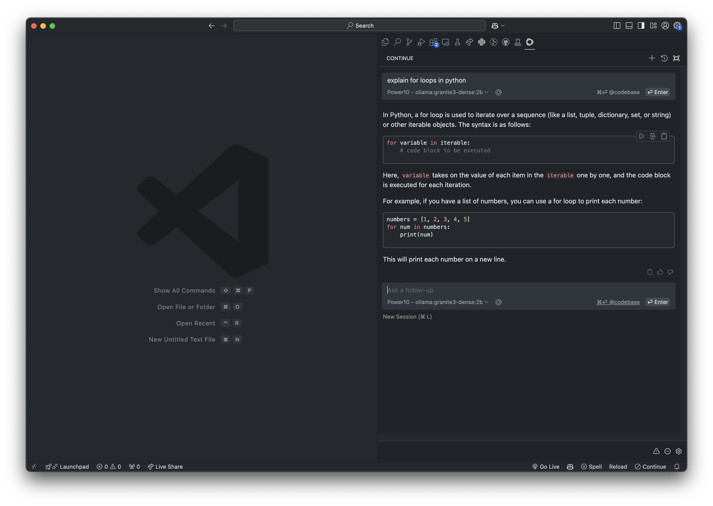

IBM Granite 3.0 is the latest evolution of large language models (LLMs) designed specifically for enterprise use. In this short blog, I want to demonstrate how to deploy the new Granite 3.0 models on IBM Power and how to connect them to your VSCode workspace locally.

## Granite 3.0 on P10

Shout out to [Marvin Gießing](https://www.linkedin.com/in/marvingiessing/) and his team for helping me get granite3 deployed on Power! 🙌

To get started with `granite3` on Power, all you need is a P9/P10 system with podman. We can leverage Ollama which has already adopted the `granite3` family of models into their library! Here is a step-by-step guide to run the models on Power:

Shout out to [Marvin Gießing](https://www.linkedin.com/in/marvingiessing/) and his team for helping me get granite3 deployed on Power! 🙌

To get started with `granite3` on Power, all you need is a P9/P10 system with podman. We can leverage Ollama which has already adopted the `granite3` family of models into their library! Here is a step-by-step guide to run the models on Power:

### 1. start the ollama container

```bash
podman run -d --privileged -v ollama:/root/.ollama -p 11434:11434 --name ollama quay.io/mgiessing/ollama:v0.3.14
```

### 2. Run the granite3-dense2b model

```bash
podman exec -it ollama ollama run granite3-dense:2b
```

### 3. Use all available threads on your P10 (I have 8cores@SMT2 => 16 threads)

```bash
>>> /set parameter num_thread 16
```

### 4. Ask the model something!

```bash
>>> Write a 300 word blurb about IBM Power10
```

Watch it in action:

Check out that Power10 performance 🔥😎

```bash
total duration:       8.551203323s
load duration:        9.001096ms
prompt eval count:    23 token(s)
prompt eval duration: 208.571ms
prompt eval rate:     110.27 tokens/s
eval count:           333 token(s)
eval duration:        8.287601s
eval rate:            40.18 tokens/s

```

## Continue

Now that we have the Granite 3.0 models running on Power, lets use the Ollama API to use the models from inside VSCode using the Continue extension.

Continue is an open-source AI-powered code assistant designed to integrate seamlessly with your IDE, such as VSCode or JetBrains. It helps developers by offering features like code autocompletion, chat-based code referencing, and natural language code rewriting. Continue supports various AI models, making it adaptable to different programming needs, and it's designed to accelerate development by keeping developers in their flow without interruptions. You can customize it to fit specific use cases, making it a valuable tool for enhancing productivity in software development.

### Install Continue

Follow these instructions to download the VSCode extension: https://docs.continue.dev/getting-started/install#vs-code


### Configure

next we need to add our configuration for the `granite3` model. Continue works great with many different LLM providers including built in support for Ollama!

If this is your first time using the extension there will be a walk-through that will guide you through configuring your first model.

Once you have Continue installed, you can configure it to use the `granite3` model by adding the following to your `config.json` file:

**~/.continue/config.json:**

```json
{
	"models": [
		{
			"apiBase": "http://HOST:11434",
			"model": "granite3-dense:2b",
			"title": "Power10 - ollama:granite3-dense:2b",
			"provider": "ollama"
		}
	]
}
```

where `HOST` is the IP address of your Power10 system.

Once you update your `config.json`, save the file and then select the model `Power10 - ollama:granite3-dense:2b` from the drop down in the chat interface. And that's it! You can now use the `granite3` models deployed on Power right within your VSCode workspace 💪



Here is some additional info on customization options: https://docs.continue.dev/customize/overview

## Future work

This should be enough to get you started on using Continue and Ollama running on Power10. In the future, I plan to release more tutorials and demos on using Continue for IBM Power specific use cases, such as:

- 👨‍💻using AI for IBM i programming
- 🧠SQL code assistant and Db2 context provider
- 💻RAG solutions for IBM Power

## Links

- original blog: 📝 https://github.com/ajshedivy/blog/issues/1
- IBM release Blog: https://www.ibm.com/new/ibm-granite-3-0-open-state-of-the-art-enterprise-models
- The models are open source and available on [Hugging Face](https://huggingface.co/ibm-granite)! 🤗
- ollama granite3 library: https://ollama.com/blog/ibm-granite
- Continue docs: https://docs.continue.dev/
